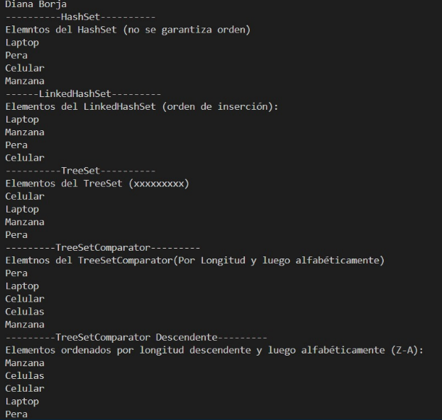

# Práctica de Sets

## 📌 Información General

- **Título:** Práctica de Sets
- **Asignatura:** Estructura de Datos
- **Carrera:** Computación
- **Estudiante:** Diana Borja
- **Fecha:** 01/07/2025
- **Profesor:** Ing. Pablo Torres

---

## 📚 Descripción:

Este proyecto muestra el uso de la interfaz Set en Java, incluyendo las implementaciones más comunes:

- HashSet
- LinkedHashSet
- TreeSet con y sin comparador personalizado

El objetivo es entender cómo funcionan los conjuntos en Java, cómo eliminan duplicados automáticamente y cómo pueden ordenarse con comparadores.

---


## 🚀 Ejecución

Para ejecutar el proyecto:

1. Compila el código:
    ```bash
    javac App.java
    ```
2. Ejecuta la aplicación:
    ```bash
    java App
    ```
## Imagen de los resultados esperados 


